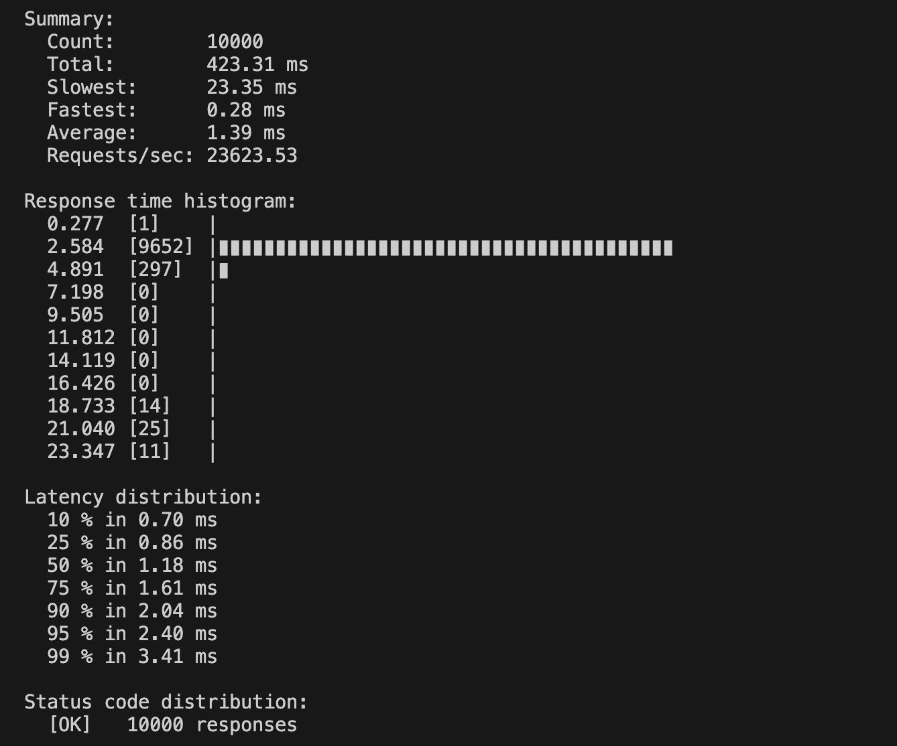

### Описание
В этом репозитории реализован простой сервис балансировщик.
Функционал следующий: сервис получает оригинальную ссылку на контент, и отдает либо ее, либо ссылку на копию контента на CDN. Параметр рзделения трафика можно настроить в `configs/config.yaml`.


### Локальный запуск
0. Указать дефолтное значение хоста cdn в конфиге. Это необязательно, можно обойтись переменной `CDN_HOST`. В конфиге можно изменить название переменной и указать долю запросов, для которых вернется оригинальная ссылка.

1.  ```
    export CDN_HOST=<cdn host>
    go mod download
    go run ./...
    ```
### Docker

#### Запуск:
```
make build
make deploy
```
#### Вызов:
```
grpcurl -d '{"uri": "https://s1.origin-cluster/video/123/xcg2djHckad.m3u8"}' -plaintext localhost:8080 Balancer/GetLink
```

### Tестирование:
##### Unit тесты:
```
make test
```

##### Нагрузочное тестирование
```
brew install ghz

ghz --insecure --proto ./api/cdn-balancer.proto --call Balancer.GetLink -d '{"uri": "https://s1.origin-cluster/video/123/xcg2djHckad.m3u8"}' -n 10000 -c 20 0.0.0.0:8080
```

### Результат
Тестирование должно показать примерно такой результат.
